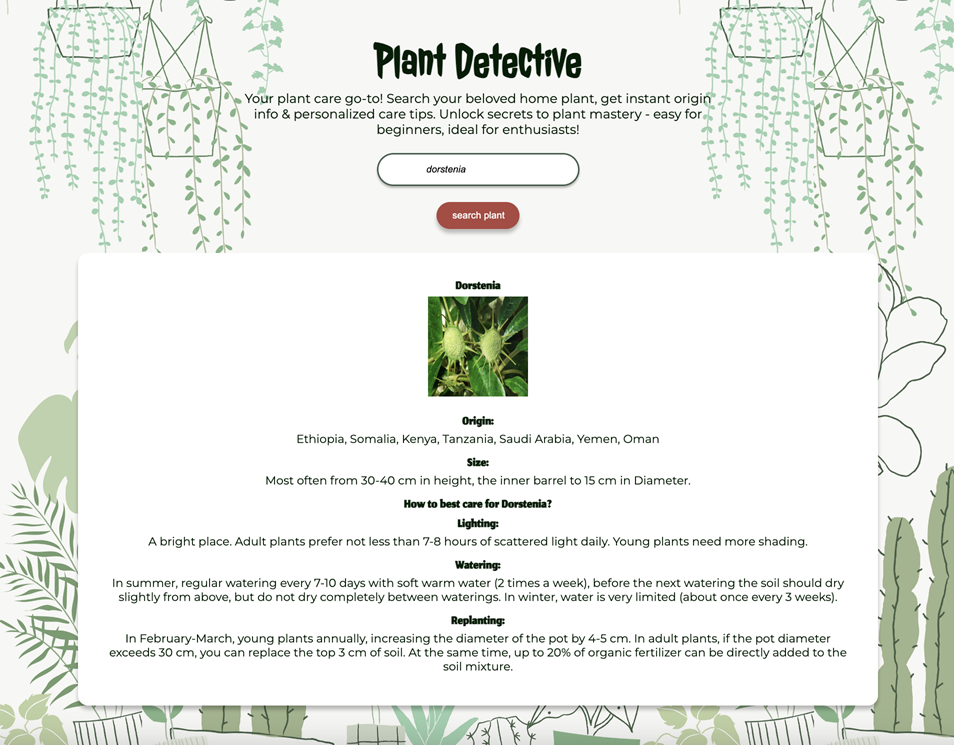
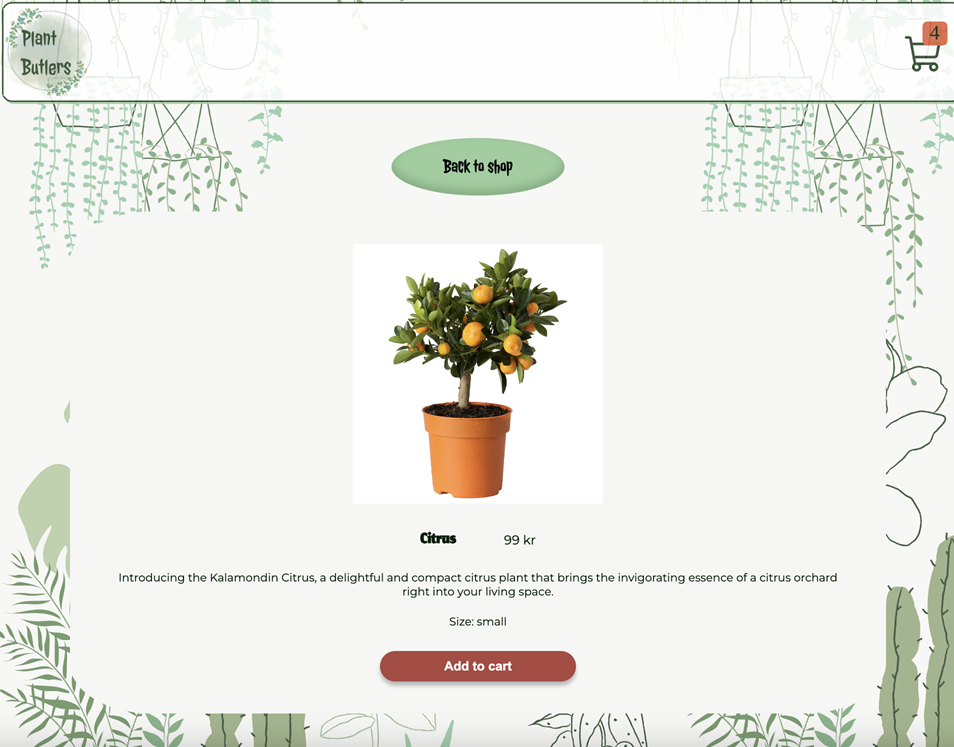

Project title: Plant Butlers

Project description: This is a project we did for our React course at Hyper Island school in Stockholm. We choose something that is not very complicated but covers all the important parts of our React course goals:

\*use and composition of custom components

\*use of useState for maintaining the state of one or more components

\*use of event handlers for user interaction

\*UI elements that update in response to app or component state changes

\*use of hooks for fetching data from an API

\*use of third party libraries

\*use of custom hooks

\*use of context for maintaing app state

\*demonstrating sode maintainability and readability

The project represents an online plant shop. It offers variety of different plants that can be filtered by their sizes. All the plants can be added to the cart and the total amount in the cart is updated accordingly. After following the check out steps and recieving your order number, the cart is emptied. We also added a Plant detective page which imports an outside API, you have the option of entering a plant name and the API will return the plants picture and all the information you may need to take care of the plant.
The project is all around great for begginers in React. You will get familiar with all the important learnings from React while also incorporating your knowledge in Javascript.

CREDITS FOR THE TEAM
We are a group of 4 women that worked on this project:

\*Maryana Reznychenko: [Maryana's GitHub](https://github.com/maryana-reznychenko)

\*Milla Lindén: [Milla's GitHub](https://github.com/millalinden)

\*Petra Milicevic: [Petra's GitHub](https://github.com/PetraaM)

\*Setayesh Nouri: [Setayesh's GitHub](https://github.com/setayeshnri)

Currently, two official plugins are available:

- [@vitejs/plugin-react](https://github.com/vitejs/vite-plugin-react/blob/main/packages/plugin-react/README.md) uses [Babel](https://babeljs.io/) for Fast Refresh
- [@vitejs/plugin-react-swc](https://github.com/vitejs/vite-plugin-react-swc) uses [SWC](https://swc.rs/) for Fast Refresh
